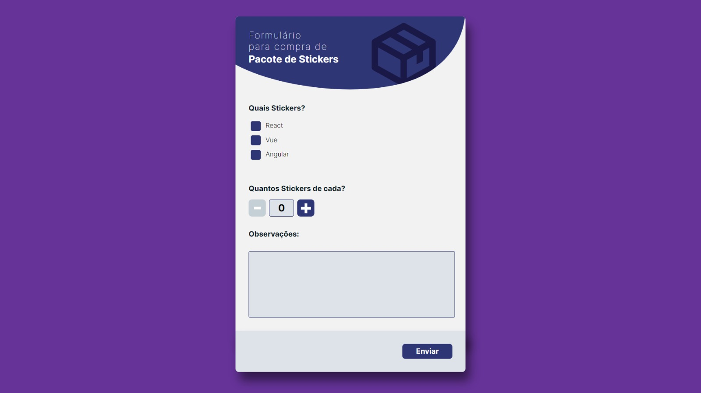
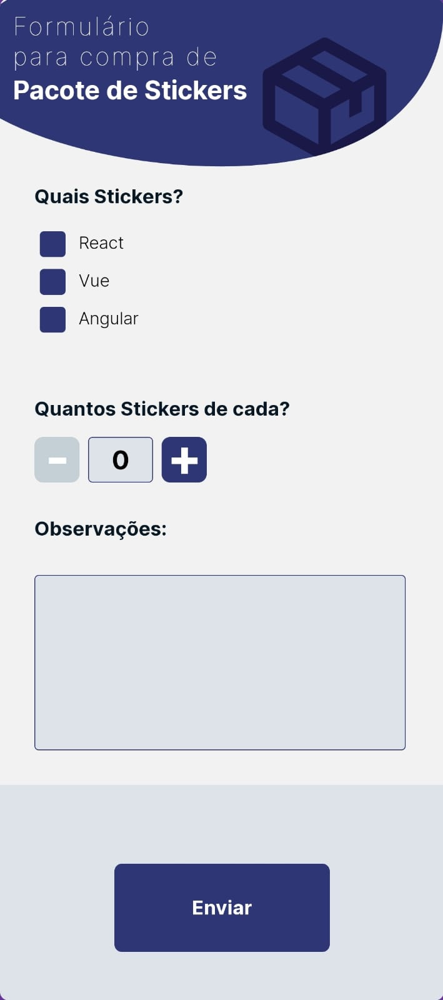

# Trabalho TAP-RAD I

No nosso dia-a-dia, temos alguns desafios, como desenvolver componentes, aplicações, lidar com prazos e etc. 

## Layout
Participamos da elaboração do Layout com UX e UI. Note que foram criados todos os cenários possíveis para essa aplicação, focado nas demandas solicitadas!

Eles disponibilizaram os layouts aqui:

#### FIGMA (para visualizar propriedades de css):
[Aqui](https://www.figma.com/file/Ly86lgfa2qYMB1mV1FYpLEQT/frontend-test?node-id=0%3A2)

Site feito para gerenciar hábitos do dia a dia 

  <a href="#-tecnologias">Tecnologias</a>&nbsp;&nbsp;&nbsp;|&nbsp;&nbsp;&nbsp;
  <a href="#-projeto">Projeto</a>&nbsp;&nbsp;&nbsp;|&nbsp;&nbsp;&nbsp;
  <a href="#-layout">Layout</a>&nbsp;&nbsp;&nbsp;|&nbsp;&nbsp;&nbsp;
  <a href="#memo-licença">Licença</a>

 

  

  

##  Tecnologias

Esse projeto foi desenvolvido com as seguintes tecnologias:

- HTML e CSS
- JavaScript
- Git e Github
- MVC

## 💻 Projeto

Página Web desenvolvida com arquitetura MVC 

- [Visite o projeto online](https://matheusgrz141.github.io/Trabalho-I--Matheus-Grzibovski-Vieira-ra181732/)

